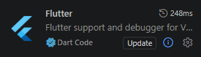
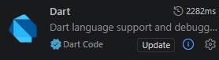
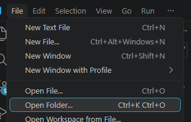
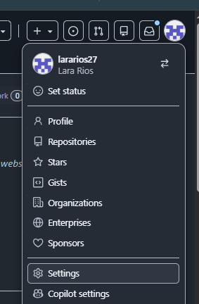

# Água para o Mate

Aplicativo desenvolvido em Flutter para medição de frequência sonora utilizando o microfone do celular para estimar a temperatura da água para o chimarrão.

---

## 1. Requisitos

Para executar o aplicativo em um celular Android, é necessário ter:

- Windows, Linux ou macOS;

- Git instalado;

- Flutter instalado;

- Android Studio instalado;

- Visual Studio Code instalado;

- Um celular Android;

- Cabo USB com suporte a transferência de dados.

\> ***Importante:** o aplicativo precisa de acesso ao microfone do celular para realizar as medições (será feito o pedido de acesso ao microfone).

---

# 2. Preparação do ambiente

Antes de abrir o projeto, é necessário instalar as ferramentas utilizadas pelo aplicativo.

## 2.1 Instalar o Git

Caso o Git ainda não esteja instalado:

1\. Acesse:

`https://git-scm.com/downloads`

2\. Baixe a versão correspondente ao seu sistema operacional.

3\. Instale utilizando as opções padrão.

Depois da instalação, abra o ***Visual Studio Code**.

---

## 2.2 Instalar o Visual Studio Code

Caso o Visual Studio Code ainda não esteja instalado:

1\. Acesse:

`https://code.visualstudio.com/`

2\. Baixe a versão correspondente ao seu sistema operacional.

3\. Instale utilizando as opções padrão.

4\. Abra o Visual Studio Code.

---

## 2.3 Instalar as extensões do VS Code

No Visual Studio Code:

1\. Clique no ícone ***Extensions** no lado esquerdo.


2\. Pesquise por:

\`\`\`text

Flutter

\`\`\`

3\. Instale a extensão Flutter, publicada pela Dart Code.



A extensão Flutter também instala ou solicita a instalação da extensão Dart, necessária para executar o projeto.



---

## 3. Baixando o projeto pelo VS Code

Todo o processo de clonagem pode ser realizado diretamente pelo Visual Studio Code.

1\. Abra o Visual Studio Code.

2\. Pressione:

\`Ctrl + Shift + P\`

3\. Na barra de comandos, procure por:

\`Git: Clone\`

4\. Selecione **\*\*Git: Clone\*\***.

5\. Cole a URL do repositório:

\`https://github.com/lararios27/agua_para_o_mate.git\`

6\. Pressione **\*\*Enter\*\***.

7\. Escolha a pasta onde deseja salvar o projeto.

8\. Aguarde o término da clonagem.

9\. Quando o VS Code perguntar se deseja abrir o projeto clonado, selecione:

**\*\*Open\*\***

Caso a pergunta não apareça:

- Clique em **\*\*File\*\***.

- Clique em **\*\*Open Folder\*\***.



- Selecione a pasta:

\`agua_para_o_mate\`

- Clique em **\*\*Select Folder\*\***.

### 3.1 Caso o GitHub solicite autenticação

Se o repositório exigir autenticação, o GitHub poderá solicitar um nome de usuário e um **\*\*Personal Access Token (PAT)\*\*** em vez da senha da conta.

\> **\*\*Importante:\*\*** se o repositório for público, normalmente não será necessário criar um token apenas para clonar o projeto.

### 3.2 Criando um Personal Access Token

Caso seja solicitado:

1\. Acesse o GitHub:

https://github.com/

2\. Faça login na sua conta.

3\. Clique na sua foto de perfil, no canto superior direito.

4\. Clique em **\*\*Settings\*\***.



5\. No menu lateral, procure **\*\*Developer settings\*\*** (última linha).

6\. Acesse **\*\*Personal access tokens\*\***.


7\. Selecione **\*\*Fine-grained tokens\*\*** ou **\*\*Tokens (classic)\*\***.

8\. Clique em **\*\*Generate new token\*\***.

9\. Informe um nome para o token, por exemplo:

\`agua-para-o-mate\`

10\. Defina uma data de expiração.

11\. Em **\*\*Repository access\*\***, selecione o repositório que deseja acessar.

12\. Conceda somente as permissões necessárias.

13\. Clique em **\*\*Generate token\*\***.

\> **\*\*ATENÇÃO:\*\*** o token funciona como uma senha de acesso. Não compartilhe o token, não coloque o token no README e não o salve dentro do código do projeto. Copie e salve ele em um lugar seguro pois não conseguirá de novo.

### 3.3 Utilizando o token

Quando o Git solicitar:

**\*\*Username:\*\***

Digite seu nome de usuário do GitHub.

Quando solicitar:

**\*\*Password:\*\***

Não digite a senha da sua conta do GitHub.

Cole o **\*\*Personal Access Token\*\*** criado anteriormente.

Ao colar o token no terminal, os caracteres podem não aparecer na tela. Isso é normal. Cole o token e pressione **\*\*Enter\*\***.

4\. Abrindo o terminal dentro do VS Code

A partir deste ponto, os comandos necessários serão executados no terminal integrado do Visual Studio Code.

Para abrir o terminal:

`Ctrl + '`

Também é possível acessar pelo menu:

`Terminal → New Terminal`

O terminal deverá estar aberto dentro da pasta do projeto:

`agua_para_o_mate`

5\. Confirmando a branch

O projeto utiliza a branch:

`development`

No terminal integrado do VS Code, execute:

```bash
git branch --show-current
```

O resultado esperado é:

`development`

Isso confirma que o projeto está sendo executado a partir da branch correta.

Caso apareça outra branch

Execute:

```bash
git fetch origin
```

Depois:

```bash
git switch development
```

6\. Instalar o Flutter

Caso o Flutter ainda não esteja instalado:

Acesse:

`https://docs.flutter.dev/get-started/install`

Baixe o Flutter SDK.

Extraia o Flutter em uma pasta de sua preferência.

Configure o Flutter no sistema seguindo as instruções da documentação oficial.

Depois da instalação, feche e abra novamente o Visual Studio Code.

No terminal integrado do VS Code, execute:

```bash
flutter --version
```

Se a versão do Flutter for exibida, a instalação foi concluída.

7\. Instalar o Android Studio

O Android Studio é necessário para disponibilizar o Android SDK e as ferramentas utilizadas pelo Flutter.

Caso ainda não esteja instalado:

Acesse:

`https://developer.android.com/studio`

Baixe o Android Studio.

Instale utilizando as opções recomendadas.

Abra o Android Studio após a instalação.

Aguarde a conclusão da configuração inicial.

Durante a instalação, certifique-se de que os seguintes componentes estejam instalados:

Android SDK;

Android SDK Platform;

Android SDK Build-Tools;

Android SDK Platform-Tools.

Depois da instalação, volte ao terminal integrado do VS Code.

Execute:

```bash
flutter doctor
```

Esse comando verificará se o Flutter e o Android SDK estão configurados corretamente.

8\. Instalar as dependências do projeto

Com o projeto aberto no VS Code, abra o terminal integrado:

`Ctrl + '`

Execute:

```bash
flutter pub get
```

Esse comando instala todas as dependências necessárias para o projeto.

Aguarde até que o comando seja concluído.

9\. Preparar o celular Android

O aplicativo será executado diretamente em um celular Android.

### 9.1 Ativar as opções do desenvolvedor

No celular:

Abra Configurações.

Role a tela até onde diz "Sobre o telefone."

Localize Número da versão ou Build number (normalmente no final).

Clique em cima 7 vezes.

Se o seu celular tiver senha, ele vai solicitar que preencha.

O Android informará que as opções do desenvolvedor foram ativadas.

A localização dessa opção pode variar dependendo do fabricante e da versão do Android.

### 9.2 Ativar a depuração USB

Depois de ativar as opções do desenvolvedor:

Volte para Configurações.

Procure por "Sistema".

Clique em "Opções de desenvolvedor".

Localize Depuração USB.

Ative a opção.

### 9.3 Conectar o celular ao computador

Conecte o celular ao computador utilizando um cabo USB que permita transferência de dados.

Depois de conectar:

Desbloqueie o celular.

Se aparecer uma mensagem perguntando:

Permitir depuração USB?

selecione:

`Permitir`

Caso apareça uma opção referente ao tipo de conexão USB, selecione:

Transferência de arquivos

10\. Verificar e executar o aplicativo pelo VS Code

### 10.1 Verificar se o celular foi reconhecido

No terminal integrado do VS Code, execute:

```bash
flutter devices
```

O celular deverá aparecer na lista de dispositivos disponíveis.

Exemplo:

Moto G60s

O nome exibido dependerá do celular utilizado.

### 10.2 Caso o celular não apareça

Se o celular não aparecer em:

```bash
flutter devices
```

verifique:

- se o celular está desbloqueado;

- se a depuração USB está ativada;

- se a autorização de depuração USB foi aceita;

- se o cabo USB permite transferência de dados;

- se o celular está conectado corretamente;

- se o Android Studio foi instalado corretamente.

Depois execute novamente:

```bash
flutter devices
```

### 10.3 Selecionar o celular no VS Code

No canto inferior direito do Visual Studio Code, clique no dispositivo atualmente selecionado.

Selecione o celular Android conectado.

### 10.4 Executar o aplicativo

Abra o arquivo:

lib/main.dart

Depois pressione:

`F5`

ou acesse:

`Run → Start Debugging`

O VS Code irá:

Compilar o aplicativo;

Instalar o aplicativo no celular;

Abrir o aplicativo no dispositivo.

A primeira compilação pode levar alguns minutos.

### 10.5 Alternativa pelo terminal do VS Code

Também é possível executar o aplicativo pelo terminal integrado do VS Code.

Com o celular conectado, execute:

```bash
flutter run
```

O Flutter irá compilar e instalar o aplicativo no celular.

### 10.6 Permissão do microfone

Na primeira execução do aplicativo, o Android poderá solicitar permissão para utilizar o microfone.

Quando aparecer a solicitação, selecione:

`Permitir`

Essa permissão é necessária porque o aplicativo utiliza o microfone do celular para realizar as medições de frequência sonora.

### 10.7 Utilizando o aplicativo

Depois que o aplicativo for aberto:

Acesse a tela de medição.

Permita o acesso ao microfone, caso solicitado.

Inicie uma medição.

O aplicativo utilizará o microfone do celular para analisar o som.

Visualize o resultado da medição.

Consulte o histórico das medições, quando necessário.

### 10.8 Executar novamente o aplicativo

Depois que o aplicativo estiver instalado no celular, ele poderá ser aberto diretamente pelo ícone:

Água para o Mate

Caso queira executar novamente pelo VS Code:

Conecte o celular ao computador.

Abra o projeto no VS Code.

Verifique se o celular aparece:

```bash
flutter devices
```

Selecione o celular no canto inferior direito do VS Code.

Pressione:

`F5`

ou execute:

```bash
flutter run
```

11\. Solução de problemas

### 11.1 O comando flutter não é reconhecido

Se aparecer uma mensagem semelhante a:

'flutter' is not recognized as an internal or external command

o Flutter provavelmente não está configurado nas variáveis de ambiente.

Verifique a instalação do Flutter e reinicie o VS Code.

Depois execute:

```bash
flutter --version
```

### 11.2 O celular não aparece no flutter devices

Verifique:

se a depuração USB está ativada;

se o celular está desbloqueado;

se a autorização de depuração USB foi aceita;

se o cabo USB possui suporte a dados;

se o celular está conectado corretamente.

Depois execute:

```bash
flutter devices
```

### 11.3 O celular aparece como unauthorized

Desbloqueie o celular.

Deverá aparecer uma solicitação semelhante a:

Allow USB debugging?

Selecione:

`Allow`

Depois execute novamente:

```bash
flutter devices
```

### 11.4 O celular aparece como offline

No terminal integrado do VS Code, execute:

```bash
adb kill-server
```

Depois:

```bash
adb start-server
```

E:

```bash
adb devices
```

Desconecte e conecte novamente o celular caso necessário.

Se aparecer uma solicitação de depuração USB no celular, selecione Permitir.

### 11.5 O aplicativo não consegue acessar o microfone

No celular, acesse:

`Configurações → Aplicativos → Água para o Mate → Permissões → Microfone`

Verifique se a permissão do microfone está configurada como:

`Permitir`

Depois abra novamente o aplicativo.

### 11.6 Problemas nas dependências

No terminal integrado do VS Code, execute:

flutter clean

Depois:

```bash
flutter pub get
```

E tente executar novamente:

```bash
flutter run
```

12\. Tecnologias utilizadas

Flutter

Dart

Android

Android Studio

Visual Studio Code

Git

GitHub

Microfone do dispositivo

13\. Repositório

Repositório do projeto:

```bash
https://github.com/lararios27/agua_para_o_mate
```

Branch utilizada:

`development`

14\. Resumo rápido

Depois que todas as ferramentas estiverem instaladas, o processo para executar o projeto é:

1\. Clonar pelo VS Code

Pressione:

Ctrl + Shift + P

Selecione:

Git: Clone

Cole:

```bash
https://github.com/lararios27/agua_para_o_mate.git
```

## 2. Abrir o projeto

Abra a pasta:

`agua_para_o_mate`

## 3. Abrir o terminal do VS Code

Pressione:

Ctrl + \`

## 4. Confirmar a branch

```bash
git branch --show-current
```

Resultado esperado:

`development`

## 5. Instalar as dependências

```bash
flutter pub get
```

## 6. Preparar o celular

Ative:

Opções do desenvolvedor → Depuração USB

Conecte o celular ao computador utilizando um cabo USB com suporte a dados.

## 7. Verificar o celular

```bash
flutter devices
```

## 8. Selecionar o celular

Clique no celular no canto inferior direito do VS Code.

## 9. Executar o aplicativo

Pressione:

`F5`

ou execute:

```bash
flutter run
```

## 10. Permitir o microfone

Quando o Android solicitar acesso ao microfone, selecione:

`Permitir`

O aplicativo estará pronto para ser utilizado.
